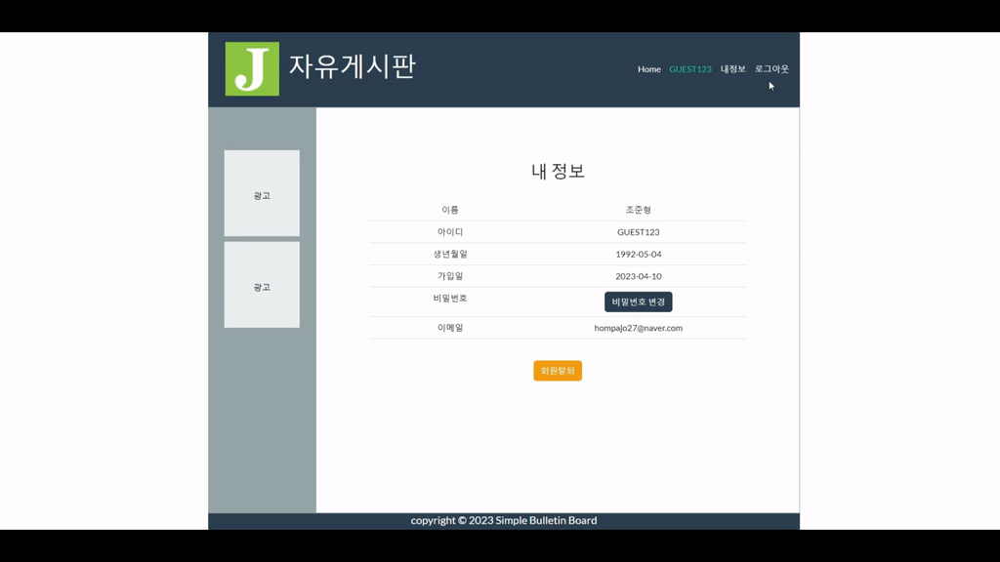
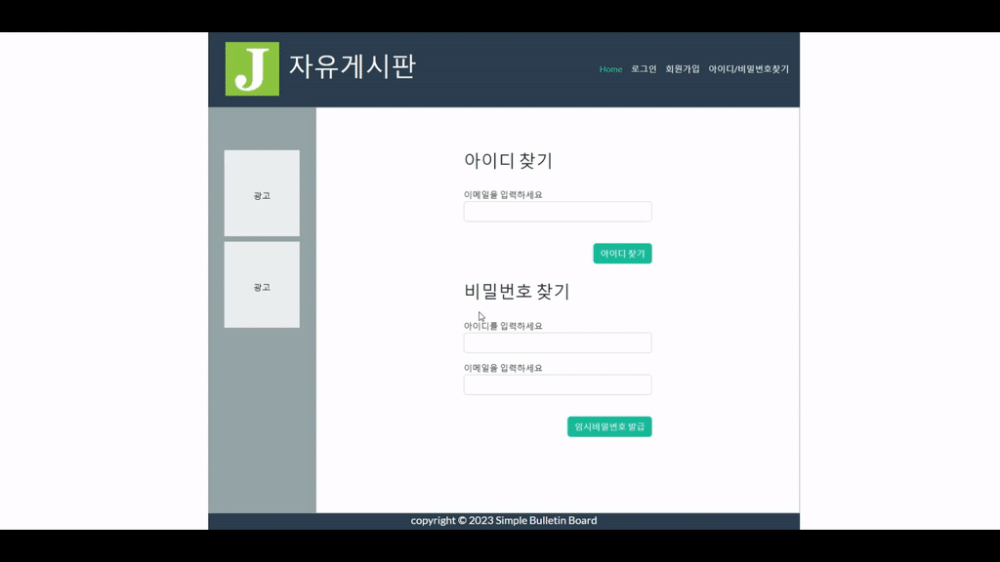
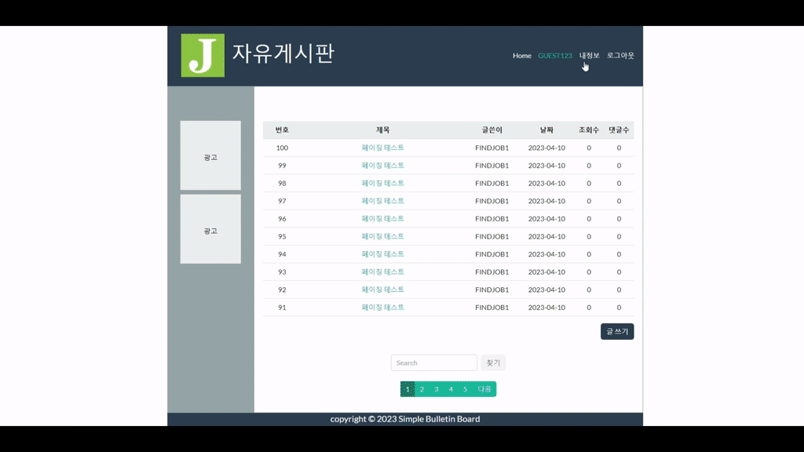
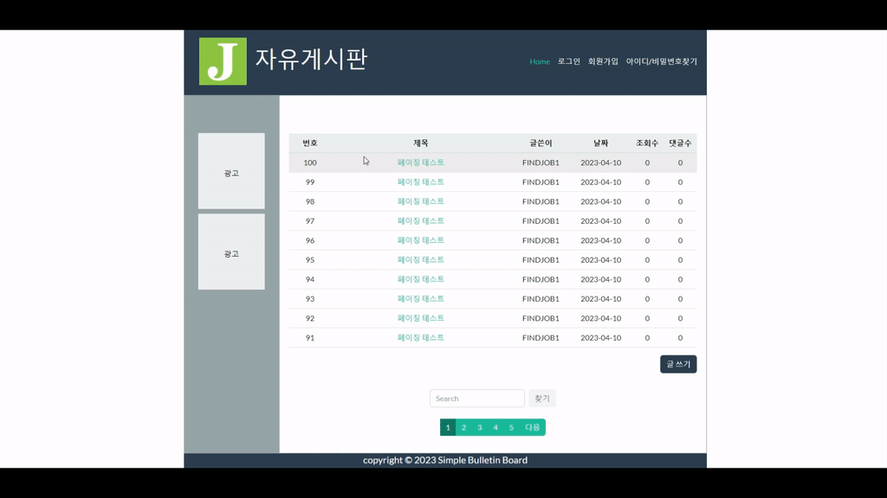
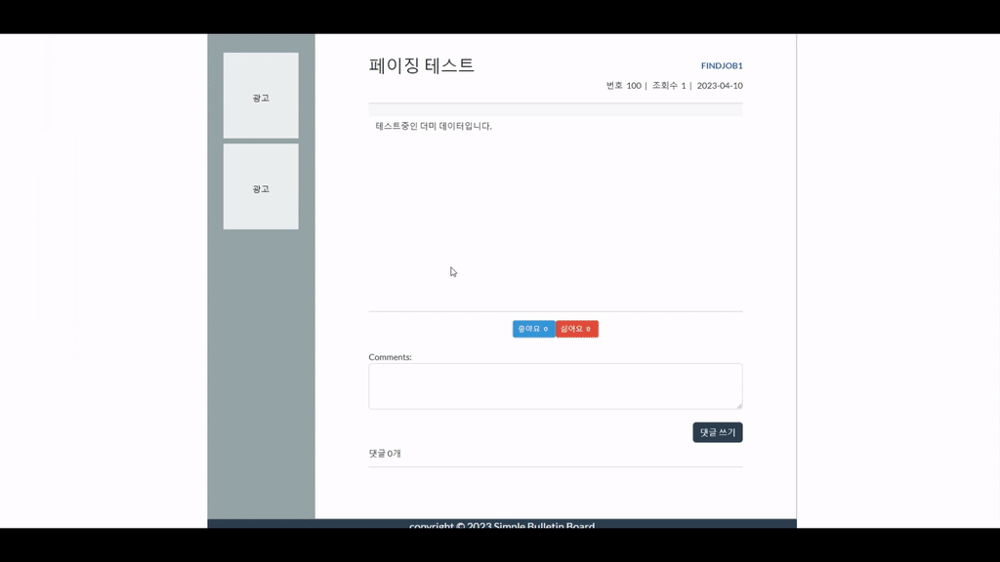
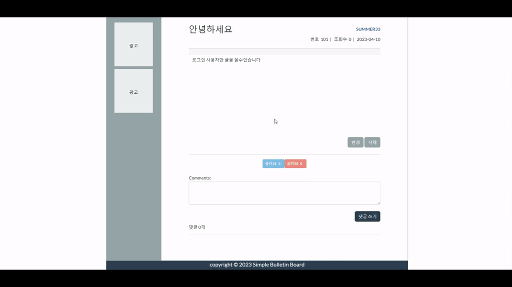
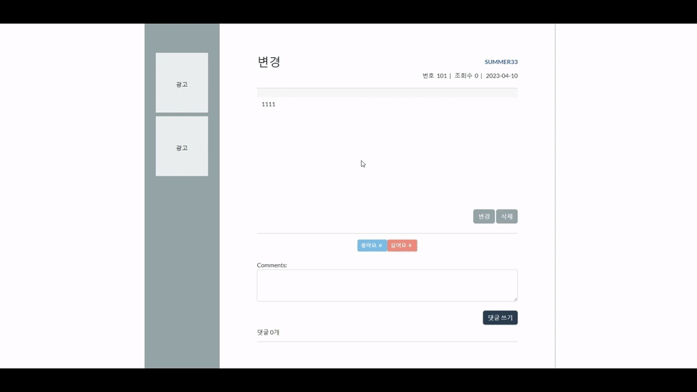
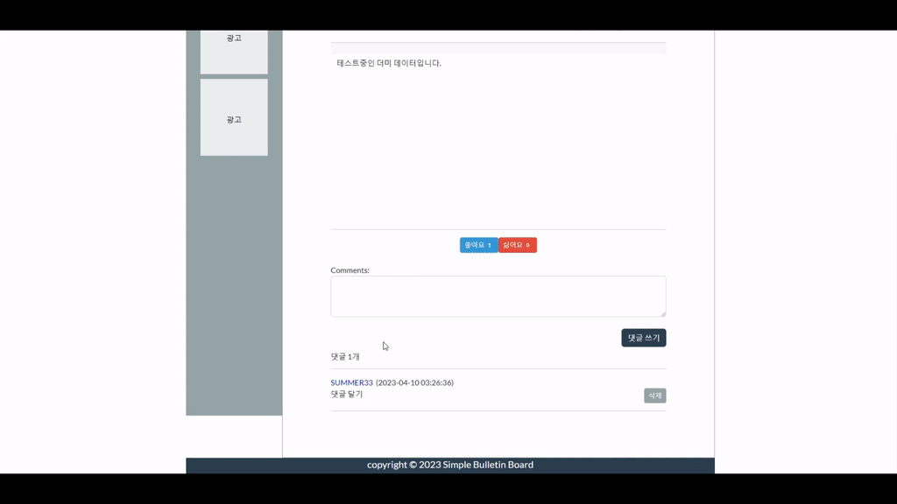
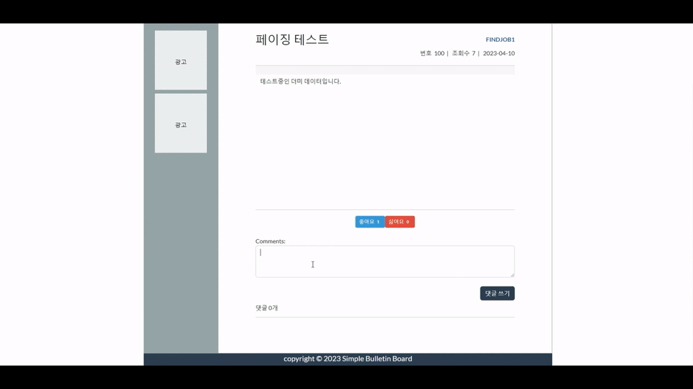

# 게시판(Bulletin Board) - 개인 프로젝트
- 게시판 시연 영상 : https://youtu.be/MYQLi3gH1RY
## 목적
- 신입 웹 개발자의 기본소양
- 어떤 웹이던지 게시판은 필수요소
- 반복된 연습으로 빠르고 최적화된 게시판 생성을 목표로함

----------------------------------------------------------------------------

## 개발환경
> Front-End
- Bootstrap 5
- Jquery 3
- Thymeleaf

> Back-End
- Spring boot 3.0.4
- JDK 17.0.3
- Oracle Database 11g Express Edition
- Mybatis 3.0.0
- Tomcat 9.0.64
- Maven 4.0.0

----------------------------------------------------------------------------

## 제작기간 - 2023/03/06 ~ 2023/04/02 ( 작업 기간: 3주 )

> 1주차 (03/06 ~ 03/12), View 페이지 및 DB 모델링
- 개발환경 설정 및 프로젝트 주제 설정  
- Bootsrap5를 이용해 HTML View 페이지 설계 및 생성  
- Oracle DB Model 설계 및 생성  
- View 페이지 완성  

> 2주차 (03/13 ~ 03/19), Spring MVC 적용 및 게시판 기본 기능 완성     
- MVC 디자인 패턴을 고려 한 프로젝트 패키지 설계 및 view 페이지 thymeleaf로 변환  
- 회원가입 기능 구현
- 로그인 및 게시판 view 기능 및 페이징 구현  
- 게시판 쓰기, 수정, 삭제 구현  
- 회원가입 아이디 중복체크, 이메일 인증 구현  

> 3주차 (03/20 ~ 03/26), 댓글, 추천, 조회수 등 세부 기능 구현  
- 게시판 CRUD 및 페이징 기능을 재사용 하여 댓글 CRUD 구현   
- 추천 및 조회수 기능 구현

> 4주차 (03/27 ~ 04/02), 마무리
- 구현된 기능들 보완 및 코드 재정리
----------------------------------------------------------------------------
## [ 패키지 구조 ]

----------------------------------------------------------------------------
## [ 데이터베이스 모델링 ]

----------------------------------------------------------------------------

## [ Front-End 기능 ]

> bootstrap5로 View 페이지 설계 및 생성

- 회원가입 페이지 아이디, 이메일 패턴 검사
~~~c
// html

	<label for="username">아이디</label>
	
	

	<input type="text" class="form-control" id="username" name="username">
	

	<label for="email">이메일</label>
	
	

	<input type="text" class="form-control" id="email" name="email">
	

// js
function usernameCheck() {
	$("#username_msg").text("");
	const pattern = /^[0-9A-Z]{8,10}$/;
	const $username = $("#username").val().toUpperCase();
	$("#username").val($username);
	const result = pattern.test($username);
	if(result==false)
		$("#username_msg").text("아이디는 대문자와 숫자 8~10자입니다").attr("class", "fail")
	return result;
}

function emailCheck() {
	$("#email_msg").text("");
	const pattern = /^[0-9a-zA-Z]([-_.]?[0-9a-zA-Z])*@[0-9a-zA-Z]([-_.]?[0-9a-zA-Z])*.[a-zA-Z]{2,3}$/i;
	const $email = $("#email").val();
	const result = pattern.test($email);
	if(result==false)
		$("#email_msg").text("이메일을 정확하게 입력하세요").attr("class", "fail");
	return result;
}

~~~

- 회원가입  알림창
~~~c
// html
 // 알림창 CDN

// js
function join() {
	const formData = new FormData($("#join_form")[0]);
	
	$.ajax({
		url: "/member/new",
		method: "post",
		data: formData,
		processData: false,
		contentType: false
	}).then(
		(result)=>{
			Swal.fire("가입신청 완료","이메일을 확인하세요", "success").then((choice)=>{
				if(choice.isConfirmed) location.href= result.url;
			})
		}, (result)=>{
			Swal.fire("가입신청 실패", msg,"error").then((choice)=>{
				if(choice.isConfirmed) location.href= result.url;
			})
		}
	)
}
~~~

- 게시판 글쓰기, 글수정 Summernote 사용  
~~~c
// html

내용 <textarea id="content" name="content"></textarea>

// js

~~~

- 목록 페이지 데이터 뿌리기  
~~~c
// html
<template id="tr_template">
	<tr>
		<td>{bno}</td>
		<td><a href="/board/read?bno={bno}" style="text-decoration: none;">{title}</a></td>
		<td>{writer}</td>
		<td>{writeTime}</td>
		<td>{readCount}</td>
		<td>{commentCount}</td>
	</tr>
</template>

// js
function printBoardList(boardList) {
	const $list = $('#list');
	const $t = $('#tr_template').html();
	for(const b of boardList) {
		$list.append($t.replace('{bno}',b.bno).replace('{bno}',b.bno).replace('{title}',b.title).replace('{writer}',b.writer)
			.replace('{writeTime}', b.writeTime).replace('{readCount}',b.readCount).replace('{commentCount}',b.commentCount));
}

$(document).ready(async function () {
	const apiUrl = 'http://localhost:8087/board/all';
	const pageno = getPageno();
	const params = {pageno};
	$.ajax({url: apiUrl, data: params}).done((response)=>{	
		printBoardList(response.result.boardList);	//ajax통신으로 매핑된 controller의 리스트 데이터를 가져와서 뿌린다
		const pagination = getPagination(response.result);
		printPagination(pagination);
	}).fail((error)=>{
		console.log(error);
	});
})
~~~

----------------------------------------------------------------------------

## [ Back-End 기능 ]

> 간략 

- 스프링 시큐리티 로그인
~~~c
// Security 설정
@Bean
protected SecurityFilterChain filterChain(HttpSecurity http) throws Exception {		
	http.csrf().disable().cors().disable()
	.authorizeHttpRequests(request -> request
        	.dispatcherTypeMatchers(DispatcherType.FORWARD).permitAll()
        	.requestMatchers("/", "/img/**","/member/join","/member/new","/member/login","/css/**","/board/list","/board/all",
        			"/board/read","/board","/js/**","/member/find/**","/member/check/**").permitAll() // 해당 요청URL 허용
                .anyRequest().authenticated()	// 어떠한 요청이라도 인증필요
        )
        .formLogin(login -> login	// form 방식 로그인 사용
        		.loginPage("/member/login")		// 커스텀 로그인 페이지 지정
        		.loginProcessingUrl("/member/login")	// submit받을 URL
        		.usernameParameter("username")
        		.passwordParameter("password")
        		.successHandler(memberLoginSuccessHandler)	// 로그인 성공 핸들러
        		.failureHandler(memberLoginFailureHandler)	// 로그인 실패 핸들러
                	.permitAll()	// 대시보드 이동이 막히면 안되므로 허용
        )
        .logout().logoutUrl("/member/logout").logoutSuccessUrl("/").invalidateHttpSession(true);  // 로그아웃은 기본설정으로 (/logout으로 인증해제)		
		http.exceptionHandling().accessDeniedHandler(accessDeniedHandler);
		return http.build();
}
~~~
~~~c
// UserDetails
@Data
@Builder
@AllArgsConstructor
@NoArgsConstructor
public class Account implements UserDetails{
	private String username;
	private String password;
	private boolean isEnabled;
	private String authorities;
	private MemberDto.User user;
	
	public Account(MemberDto.User user) {
	    Collection<GrantedAuthority> collect = new ArrayList<>();	
	    this.username = user.getUsername();
	    this.password = user.getPassword();
	    this.isEnabled = user.getEnabled();
	    this.authorities = user.getRole();
	    this.user = user;
	}
}

// UserDetailsService
@Service
public class MyUserDetailsService implements UserDetailsService{
	@Autowired
	private MemberDao memberDao;
	
	@Override
	public UserDetails loadUserByUsername(String username) throws UsernameNotFoundException {
		Optional<Member> memberOptional = memberDao.findById(username);
		Member member = memberOptional.orElseThrow(()-> new UsernameNotFoundException("사용자를 찾을 수 없습니다"));
		Account account = new Account(member.toDto()); 
		return account;		// 최종적으로 UserDetails 객체를 리턴한다
	}
}
~~~

- Mail 전송
~~~c
// application.properties에 메일 설정
spring.mail.host=smtp.gmail.com
spring.mail.port=587
spring.mail.username=secret@gmail.com
spring.mail.password=sdlkfsdlkfj
spring.mail.properties.mail.smtp.auth=true
spring.mail.properties.mail.smtp.timeout=5000
spring.mail.properties.mail.smtp.starttls.enable=true

// Mail Dto
public class Mail {
	private String from;
	private String to;
	private String subject;
	private String text;
}

// Mail 전송
@Component //개발자가 직접 작성한 Class를 Bean으로 등록하기 위한 Annotation
public class MailUtil {
	@Autowired
	private JavaMailSender javaMailSender;
	
	// 메일 설정
	private void sendMail(Mail mail) {
		MimeMessage message = javaMailSender.createMimeMessage(); //MultiPart 데이터를 처리할 수 있고, 메일의 내용을 설정
		MimeMessageHelper helper;
		try {
			helper = new MimeMessageHelper(message, false, "utf-8"); // false는 멀티파트 메세지를 사용하지 않겠다는 의미
			helper.setFrom(mail.getFrom());
			// application.properties에 설정한 아이디는 단순히 smtp 인증을 받기 위해 사용함 따라서 보낸이(setFrom())는 반드시 필요
			helper.setTo(mail.getTo());
			helper.setSubject(mail.getSubject());
			helper.setText(mail.getText(), true); // true는 html을 사용하겠다는 의미
			javaMailSender.send(message);
		} catch(MessagingException e) {
			e.printStackTrace();
		}
	}
}
~~~

- 게시판 페이징   
~~~c
// Dto
@Data
@AllArgsConstructor
public static class Page {
	private Integer pageno;		// 페이지 번호
	private Integer pagesize;	// 한 페이지의 사이즈
	private Integer totalCount;	// 전체 게시글 수
	private Collection<ListDto> boardList;	// 게시글
}

// Service
public BoardDto.Page list(Integer pageno, String writer) {
	Integer totalCount = dao.count(writer);
	Integer countOfPage = (totalCount-1)/pagesize + 1;	// 전체 페이지 수
	if(pageno>countOfPage) {	
		pageno = countOfPage;
	}else if(pageno<0) {
		pageno = -pageno;
	}else if(pageno==0) {
		pageno = 1;
	}
	Integer start = (pageno-1)*pagesize+1;	// 게시글 번호에 따라 보여지는 페이지의 시작 번호
	Integer end = start+pagesize-1;		// 게시글 번호에 따라 보여지는 페이지의 마지막 번호
	
	Map<String, Object> map = new HashMap<>();
	map.put("start", start);
	map.put("end", end);
	map.put("writer", writer);
	return new Page(pageno, pagesize, totalCount, dao.findAll(map));	
}
~~~

----------------------------------------------------------------------------

## [ 요청 처리 과정 ]
`요청 > 컨트롤러 > 서비스 > 서비스 구현 > DAO > Mapper > Mybatis > DB > 컨트롤러(DB 반환)`

>  간단 소개
  
- 아이디 중복 확인
~~~c
// 중복 확인 요청
$("#username").on("blur", function() {
	if(usernameCheck()==false)
		return false;
	$.ajax("/member/check/username?username=" + $("#username").val())
		.then(
			()=>$("#username_msg").text("좋은 아이디네요").attr("class", "success"),
			()=>$("#username_msg").text("사용중인 아이디입니다").attr("class", "fail")
		);
});
~~~
~~~c
// Controller
// Ajax 요청이기 때문에 화면 이동없이 요청 URL Body에 문자열을 반환해준다
@Controller
public class MemberController {
	@Autowired
	private MemberService service;
	
	@GetMapping(path="/member/check/username", produces = MediaType.APPLICATION_JSON_VALUE)
	public ResponseEntity<RestResponse> idCheck(@Valid MemberDto.Idcheck dto) {
		if(service.idCheck(dto))
			return ResponseEntity.ok(new RestResponse("OK", "사용 가능한 아이디입니다", null));
		return ResponseEntity.status(HttpStatus.CONFLICT).body(new RestResponse("Fail", "사용중인 아이디입니다", null));
	}
}
~~~
~~~c
// Service
@Service
public class MemberService {
	@Autowired
	private MemberDao memberDao;
	
	// 아이디 중복 확인
	public Boolean idCheck(MemberDto.Idcheck dto) {
		return !memberDao.existsById(dto.getUsername());
	}
}
~~~
~~~c
// Dao
@Mapper
public interface MemberDao {
	public Boolean existsById(String username);
}
~~~
~~~c
// Mapper(.xml)
<mapper namespace="com.example.demo.dao.MemberDao">
	<select id="existsById" resultType="boolean">
		select count(*) from member where username=#{username} and rownum&lt;=1
	</select>
<mapper>
~~~
----------------------------------------------------------------------------

> Member
## [ 회원가입 ]    
    
## [ 로그인 ] 
       
## [ 내 정보 조회 ]  
  
## [ 로그아웃 ]  

## [ 아이디 찾기 ]  

## [ 비밀번호 찾기 ]

## [ 비밀번호 변경 ]

## [ 회원탈퇴 ]

----------------------------------------------------------------------------

> Board 
## [ 전체 게시글 가져오기 및 페이징 ]  
   
## [ 비로그인 게시글 읽기,쓰기 ]  
    
## [ 로그인 게시글 읽기 및 조회 수 올리기 ]  

## [ 추천 수 올리기 ]

## [ 게시글 쓰기 ] 
  
## [ 게시글 수정 ]  
  
## [ 게시글 삭제 ] 
  
----------------------------------------------------------------------------

> Comment   
## [ 댓글 작성 ]    
  
## [ 댓글 삭제 ] 
    
## [ 댓글 수 세기 ]   
 
----------------------------------------------------------------------------

## [ 추가 또는 보완해야 할 기능 ]
- 파일 업로드 / 다운로드 추가
- Summernote(웹 에디터) 게시글 변경 시 textarea 포커싱 맨뒤로
- Summernote 게시글 작성 시 Oracle DB에 p태그 제거
- 게시판 검색 기능
- 회원가입 이메일 승인 로직 설정(isEnabled)
- 네이버 로그인(SNS) 연동 추가

## [ 프로젝트 중 오류 ]
- Summernote 웹 에디터로 게시글 수정할 때 textarea에 먼저 작성된 글(DB)을 불러오는 데 value속성으로 되지 않고
  <textarea>여기에 값을 넣어줬는데 실패함</textarea>
	- textarea의 선택자말고 Summernote에디터 내부 설정 선택자($(".note-editable").html(board.content);)를 잡고 넣어서 해결
- 메인 화면 로고 이미지가 저장 위치 설정 오류로 나타나지 않음
	- 먼저 이미지가 저장된 절주소가 틀렸고 타임리프 문법 th:src="@{/img/logo.png}" 으로 해결
- 스프링 시큐리티 WebSecurityConfigurerAdapter 객체를 사용할 수 없었음
	- pom.xml의 스프링 버전 확인해보니 사용 할 수 없는 버전이라 SecurityFilterChain으로 대체
- security config 설정을 잡는 데 어려움을 겪음
	- 비로그인 시에도 사용 가능한 View를 requestMatcher로 따로 설정함
- 회원가입시 아이디 중복체크할 때 이미 db에 있는 아이디를 넣으면 사용이 가능하다고 뜸
	- DB와 연결되지 않음을 확인 후 UserDetails와 UserDetailsService를 사용해서 DB와 연결
- 회원 가입하면 가입한 회원의 로그인이 제한 됨
	- UserDetails 객체의 isEnabled메소드를 true로 설정
	- 원래는 default 0으로 설정된 enabled를 이메일 인증으로 1로 바꿔줘야함
- 로그인 실패 횟수가 로그인을해도 초기화되지않음
	- SecurityConfig에서 FilterChain의 설정 중 defaultSuccessUrl이 지정되어 있어
          SuccessHandler의 failCount 초기화 기능이 사용되지 않았음 그래서 defaultSuccessUrl제거
- 회원을 탈퇴하면 DB에서는 데이터가 삭제되는데 로그아웃되지 않은 루트페이지(내정보)로 이동됨
	- ajax를 2번 호출(delete, logout) / delete ajax가 성공하면 success함수로 logout ajax로 다시 호출
- 페이징이 6까지만 렌더링됨(html에 li태그 7개)
	- 반복문의 오류를 파악하고 chatgpt 도움으로 페이징 공식을 참고해(변수 i를 5로 나눈 나머지값) 다시 설정
- 메일을 만들었는 데 보내지지 않음
	- application.properties에 메일을 설정함
- 댓글을 삭제해도 댓글 수가 바뀌지 않음
	- 게시판 mapper의 댓글 수 바꾸는 쿼리를 작성하지 않음 
